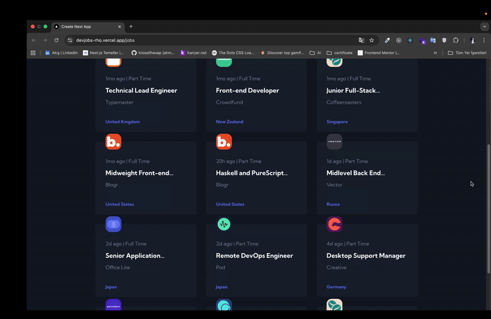

# DevJobs

DevJobs is a modern job listing web application built with **Next.js**, **React**, **Firebase**, and **Tailwind CSS**. It allows users to browse, search, and filter developer job postings efficiently. The app supports dark mode, persistent filters using `localStorage`, and responsive design for all screen sizes.

## Features

- **Job Listings**: Browse all available job postings fetched from Firebase Firestore.
- **Search & Filter**: Filter jobs by position, company, location, and contract type (full-time).
- **Job Details**: View detailed information about each job, including company info, requirements, and responsibilities.
- **Responsive UI**: Fully responsive layout for desktop, tablet, and mobile devices.
- **Dark Mode**: Supports both light and dark themes.
- **Persistent Filters**: Filters are saved in `localStorage` and persist between sessions.

## Tech Stack

- **Frontend**: Next.js (app router, client components), React, Tailwind CSS
- **Backend**: Firebase Firestore
- **State Management**: React Context API
- **TypeScript**: Ensures type safety
- **Other Libraries**: `react-icons`, `next-themes`

## Project Structure

```
/app
  /components
    - Card.tsx
    - SearchBar.tsx
    - Button.tsx
    - RequirementsContent.tsx
    - RoleContent.tsx
  /context
    - globalContext.tsx
  /firebase.ts
  /types.ts
  /jobs
    - page.tsx        # Job listing page
    - [id].tsx        # Job detail page
```

- **Global Context**: Stores job data and filter states across the app.
- **Firebase Integration**: Fetches jobs and individual job details from Firestore.
- **Dynamic Routing**: Each job has a unique page accessible via its ID.

## Installation

1. Clone the repository:

```bash
git clone <your-repo-url>
cd devjobs
```

2. Install dependencies:

```bash
npm install
```

3. Set up Firebase:

   - Create a Firebase project.
   - Add Firestore database.
   - Update `firebase.ts` with your Firebase configuration.

4. Run the development server:

```bash
npm run dev
```

The app should now be running at `http://localhost:3000`.

## Usage

- Use the search bar to filter jobs by **position**, **company**, **location**, or **full-time status**.
- Click on a job card to view its **detailed page** with requirements and role responsibilities.
- Filters persist in local storage, so your preferences are saved between sessions.

## Scripts

| Command         | Description              |
| --------------- | ------------------------ |
| `npm run dev`   | Start development server |
| `npm run build` | Build production app     |
| `npm run start` | Start production server  |
| `npm run lint`  | Run ESLint               |

## Contributing

Contributions are welcome! Feel free to open issues or submit pull requests for improvements.

## License

This project is **private**, but you can adapt it for personal or commercial use.

Live:https://devjobs-rho.vercel.app/jobs

Github:https://github.com/kisisellhesap/devjobs


